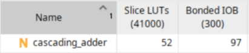
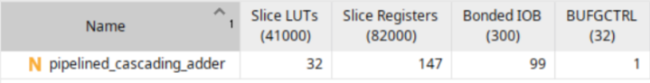
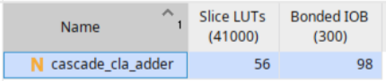
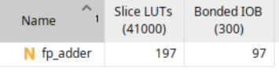

# Assignment 1 [(github)](https://github.com/TharakaUJ/Digital-System-Design-Workings)

## Exercise 2
 - 32 bit adder using 4 x 8 bit adders (cascading). Estimate the total time required to add 4 pairs.
 - 32 bit adder using 4 x 8 bit adders using pipelining

My implementation of the above exercises can be found in the `rpc_adder` folder. The `rpc_adder/rtl` folder contains the following files:
    - `full_adder.sv` - 1 bit full adder
    - `N-bit_adder_cascading.sv` - N bit adder using N 1 bit full adders
    - `4x8bit_pipelined_adder.sv` - 32 bit adder using 4 x 8 bit adders with pipelining
    - `4x8bit_cascading_adder.sv` - 32 bit adder using 4 x 8 bit adders (cascading)

### Resource utilization

## Exercise 3
 - 32 bit carry lookahead adder using 4 x 8 bit CLAs.
 - Compare performance of this with the adder in Ex2 (cascade)

 My implementation of the above exercises can be found in the `cla_adder` folder. The `cla_adder/rtl` folder contains the following files:
    - `8bit_cla_adder.sv` - 8 bit carry lookahead adder
    - `4x8bit_cla_adder.sv` - 32 bit carry lookahead adder using 4 x 8 bit CLAs

### Resource utilization

### Comparison of performance between the 32 bit adder using 4 x 8 bit adders (cascading) and the 32 bit carry lookahead adder using 4 x 8 bit CLAs 

## Exercise 4
 - floating point adder/subtractor for IEEE 754 single precision format

 My implementation of the above exercise can be found in the `fp_adder` folder. The `fp_adder/rtl` folder contains the following files:
    - `fp_adder.sv` - floating point adder/subtractor for IEEE 754 single precision format

### Resource utilization

## How to run the code using the Makefile
1. Clone the repository to your local machine.
2. Edit the Makefile to use your prefered simulator (Icarus Verilog or Verilator). I am using Icarus Verilog for my implementation.[text](../vivado/utilization_report.txt)
2. Navigate to the folder `Adders`.
3. Run `make sim TB=<testbench_file_name>`.
4. The simulation results will be generated in the `build` folder. You can view the waveform using a waveform viewer like GTKWave.

## [complete report utilization](./utilization_report.txt)

## Comparison of performance between the 32 bit adder using 4 x 8 bit adders (cascading) and the 32 bit carry lookahead adder using 4 x 8 bit CLAs

The pipelined adder has a higher maximum frequency (Fmax) compared to the cascading adder. The pipelined adder can achieve a higher maximum frequency, than the cascading adder. This is because the pipelined adder has a shorter critical path due to the use of registers between stages, allowing for faster operation.

But pipelined adder takes more time to flush the pipeline and produce the final result, as it requires multiple clock cycles to complete the addition operation. In contrast, the cascading adder can produce the final result in a single clock cycle, but at a lower maximum frequency.